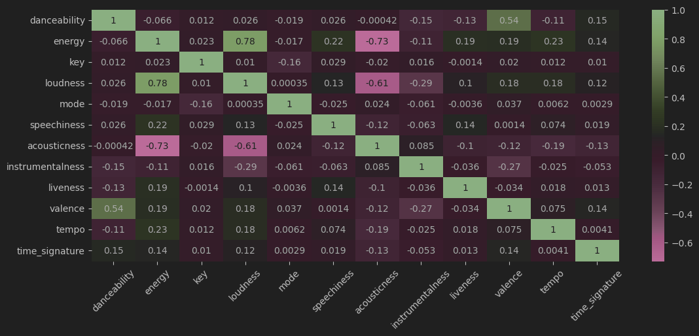
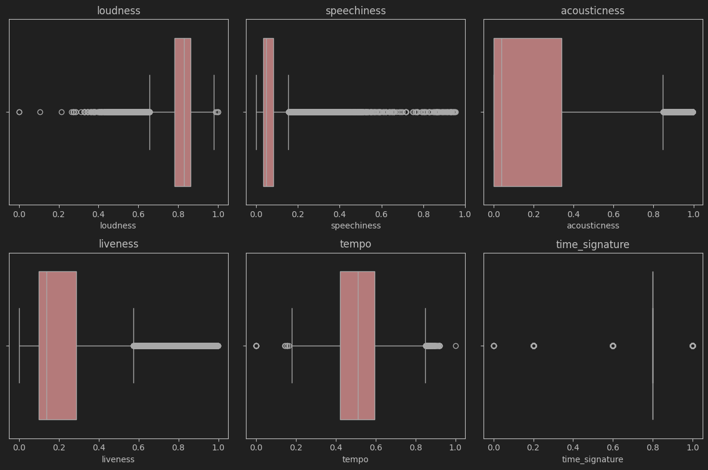
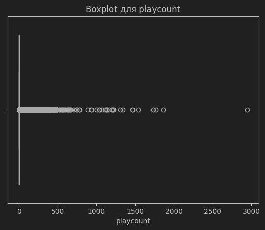
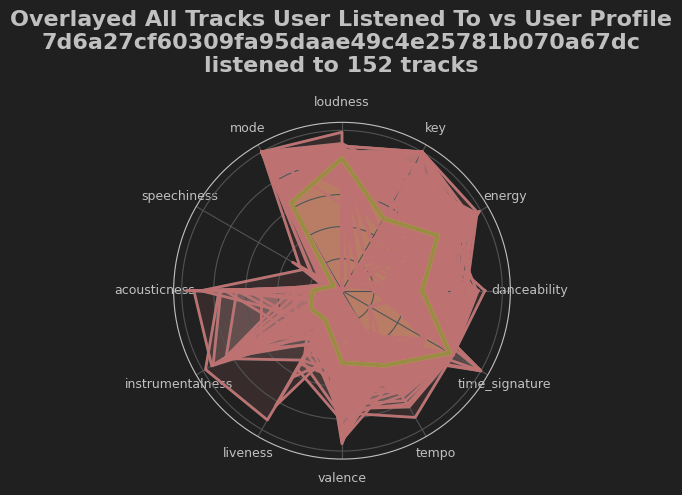

<p align="center">
    
</p>

# Розробка системи рекомендацій на основі аналізу даних Spotify

## Зміст:
1. [Опис](#опис)
2. [Датасет](#посилання-на-датасет)
3. [Опис датасету](#опис-датасету)
   1. [Датасет з даними про треки](#датасет-з-даними-про-треки)
      1. [Що було змінено?](#що-було-зроблено-з-завантаженими-даними)
      2. [Кореляція](#перевірка-кореляції-даних)
      3. [Викиди](#викиди)
   2. [Датасет з даними про користувачів](#датасет-з-даними-про-користувачів)
      1. [Унікальні значення](#відношення-кількості-унікальних-значень)
      2. [Викиди](#викиди-1)
4. [Аналіз даних](#покроковий-аналіз-даних)
5. [Профілі користувачів](#створення-профілів-користувачів)
    1. [Візуалізація профілів](#візуалізація-декількох-створених-профілів)
    2. [Візуалізація смаку користувача і порівняння з його профілем](#візуалізація-всіх-треків-які-слухав-випадковий-користувач-і-порівняння-з-його-профілем)
5. [Кластеризація](#кластеризація-даних)
6. [Порівняння методів кластеризації](#порівняння-методів-кластеризації-даних)
7. [Колаборативна фільтрація](#колаборативна-фільтрація)
8. [Колаборативна фільтрація з кластерами](#колаборативна-фільтрація-з-кластерами--порівняння)
9. [Передбачення кількості прослуховувань](#передбачення-кількості-прослуховувань)
10. [Фільтрація базована на контенті](#фільтрація-базована-на-контенті)
11. [Метрики відстані](#порівняння-різних-метрик-відстані)
12. [Оптимальна метрика](#вибір-оптимальної-метрики)
13. [Фільтрація базована на контенті з кластерами](#фільтрація-базована-на-контенті-з-кластерами--порівняння)
14. [Порівняння колаборативної та базованої на контенті фільтрацій](#порівняння-колаборативної-і-базованої-на-контенті-фільтрацій)
15. [Гібридний метод](#гібридний-метод)

## Опис:
Метою курсової роботи був аналіз даних Spotify, його рекомендаційної системи та пошук оптимального варіанту власної імплементації системи рекомендацій. Спочатку ідея була у використанні даних з API, проте оскільки доступ було обмежено, аналіз проводився на відкритому датасеті взятому з платформи kaggle.

### Посилання на датасет:
https://www.kaggle.com/datasets/undefinenull/million-song-dataset-spotify-lastfm?select=User+Listening+History.csv

## Опис датасету:
Датасет склвдається з двох файлів: **Music Info.csv** та **User Listening History.csv**, що відповідно містять дані про треки та про історію прослуховувань. У подальшому перший датасет буде використано для побудови колаборативної фільтрації за принципом *user to user (user-based)*, побудови профілів користувачів, їх візуалізацій та кластеризації. Другий буде використано для візуалізації смаків та фільтрації базованої на контенті.

### Датасет з даними про треки:
```text
<class 'pandas.core.frame.DataFrame'>
RangeIndex: 50683 entries, 0 to 50682
Data columns (total 18 columns):
 #   Column            Non-Null Count  Dtype  
---  ------            --------------  -----  
 0   track_id          50683 non-null  object 
 1   name              50683 non-null  object 
 2   artist            50683 non-null  object 
 3   spotify_id        50683 non-null  object 
 4   year              50683 non-null  int64  
 5   duration_ms       50683 non-null  int64  
 6   danceability      50683 non-null  float64
 7   energy            50683 non-null  float64
 8   key               50683 non-null  int64  
 9   loudness          50683 non-null  float64
 10  mode              50683 non-null  int64  
 11  speechiness       50683 non-null  float64
 12  acousticness      50683 non-null  float64
 13  instrumentalness  50683 non-null  float64
 14  liveness          50683 non-null  float64
 15  valence           50683 non-null  float64
 16  tempo             50683 non-null  float64
 17  time_signature    50683 non-null  int64  
dtypes: float64(9), int64(5), object(4)
memory usage: 7.0+ MB
```
#### Що було зроблено з завантаженими даними:
* Видалено колонку tags, оскільки вона не мала даних для побудови рекомендацій.
* Видалено колонку genre, оскільки кількість відсутніх даних була більшою за 50%.

#### Перевірка кореляції даних:


#### Викиди:


### Датасет з даними про користувачів:
```text
<class 'pandas.core.frame.DataFrame'>
RangeIndex: 9711301 entries, 0 to 9711300
Data columns (total 3 columns):
 #   Column     Dtype 
---  ------     ----- 
 0   track_id   object
 1   user_id    object
 2   playcount  int64 
dtypes: int64(1), object(2)
memory usage: 222.3+ MB
```
#### Відношення кількості унікальних значень:
```text
track_id        30459      0.3136%
user_id         962037     9.9064%
playcount       430        0.0044%
```
#### Викиди:



## Покроковий аналіз даних:
* [Analysis of Features data](notebooks/0.%20Spotify%20Data%20Analysis%20%28EDA%29.ipynb)
* [Analysis of Users data](notebooks/0.%20USERS_Spotify_Data_Analysis.ipynb)

## Створення профілів користувачів:
* [1. Creating and Visualizing User Profile.ipynb](notebooks/data-preprocessing/1.%20Creating%20and%20Visualizing%20User%20Profile.ipynb)
* [1. (additional) hypothesis about profiles.ipynb](notebooks/data-preprocessing/1.%20%28additional%29%20hypothesis%20about%20profiles.ipynb)

### Візуалізація декількох створених профілів


### Візуалізація всіх треків, які слухав випадковий користувач і порівняння з його профілем


## Кластеризація даних:

## Порівняння методів кластеризації даних:

## Колаборативна фільтрація:


## Колаборативна фільтрація з кластерами / порівняння:

## Передбачення кількості прослуховувань:

## Фільтрація базована на контенті:

## Порівняння різних метрик відстані:

## Вибір оптимальної метрики:

## Фільтрація базована на контенті з кластерами / порівняння:

## Порівняння колаборативної і базованої на контенті фільтрацій:

## Гібридний метод:

[Повернутися на початок](#розробка-системи-рекомендацій-на-основі-аналізу-даних-spotify)