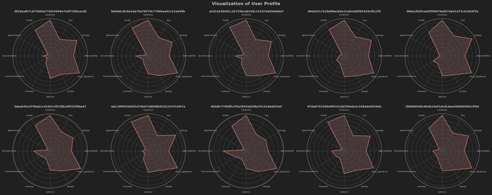
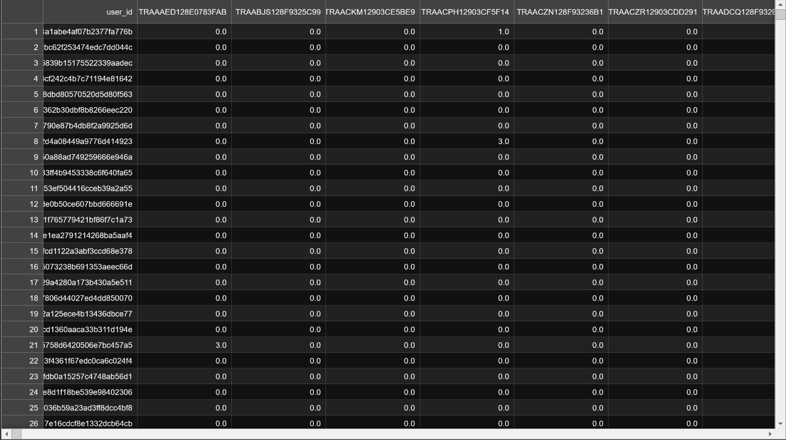
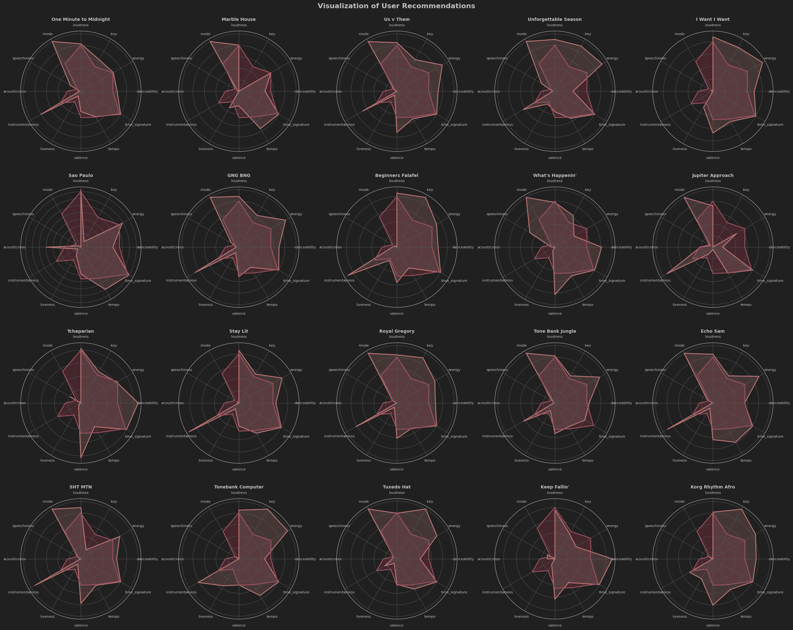

<p align="center">
    
</p>

# Розробка системи рекомендацій на основі аналізу даних Spotify

## Зміст:
1. [Опис](#опис)
2. [Датасет](#посилання-на-датасет)
3. [Опис датасету](#опис-датасету)
   1. [Датасет з даними про треки](#датасет-з-даними-про-треки)
      1. [Що було змінено?](#що-було-зроблено-з-завантаженими-даними)
      2. [Кореляція](#перевірка-кореляції-даних)
      3. [Викиди](#викиди)
   2. [Датасет з даними про користувачів](#датасет-з-даними-про-користувачів)
      1. [Унікальні значення](#відношення-кількості-унікальних-значень)
      2. [Викиди](#викиди-1)
4. [Аналіз даних](#покроковий-аналіз-даних)
5. [Профілі користувачів](#створення-профілів-користувачів)
    1. [Візуалізація профілів](#візуалізація-декількох-створених-профілів)
    2. [Візуалізація смаку користувача і порівняння з його профілем](#візуалізація-всіх-треків-які-слухав-випадковий-користувач-і-порівняння-з-його-профілем)
5. [Кластеризація](#кластеризація-даних)
   1. [Kmeans](#kmeans)
      1. [Метод "ліктя"](#метод-ліктя)
      2. [Обрання кількості кластерів](#обрання-оптимальної-кількості-кластерів)
   2. [Ієрархічний метод (знизу - вгору)](#ієрархічний-метод)
      1. [Обрання кількості кластерів](#пошук-оптимальної-кількості-кластерів)
6. [Порівняння методів кластеризації](#порівняння-методів-кластеризації-даних)
7. [Колаборативна фільтрація](#колаборативна-фільтрація)
   1. [Створення загальної матриці взаємодій](#створення-матриці-користувач-трек)
   2. [Передбачення кількості прослуховувань](#передбачення-кількості-прослуховувань-на-основі-пошуку-схожих-користувачів)
   3. [Візуалізація](#візуалізація-рекомендацій-для-випадкового-користувача)
   4. [Порівняння рекомендацій з профілем користувача](#порівняння-узагальнених-рекомендацій-з-профілем-користувача)
8. [Колаборативна фільтрація з кластерами](#колаборативна-фільтрація-з-кластерами--порівняння)
   1. [Створені датасети](#датасети-матриці-користувач-трек-створені-на-основі-кластерів)
   2. [Приклад матриці взаємодій](#приклад-заповненого-датасету)
   3. [Візуалізація рекомендацій з кластерами](#візуалізація-рекомендацій-за-кластером)
   4. [Візуалізація рекомендацій без кластерів](#візуалізація-рекомендацій-для-того-ж-користувача-проте-використовуючи-загальну-матрицю)
   5. [Порівняння втрат](#порівняння-втрат-на-випадковому-користувачеві)
9. [Фільтрація базована на контенті](#фільтрація-базована-на-контенті)
10. [Метрики відстані](#порівняння-різних-метрик-відстані)
11. [Оптимальна метрика](#вибір-оптимальної-метрики)
12. [Фільтрація базована на контенті з кластерами](#фільтрація-базована-на-контенті-з-кластерами--порівняння)
13. [Порівняння колаборативної та базованої на контенті фільтрацій](#порівняння-колаборативної-і-базованої-на-контенті-фільтрацій)
14. [Гібридний метод](#гібридний-метод)

## Технології використані:
* python
* pandas
* numpy
* matplotlib.pyplot та seaborn
* scipy
* sklearn

## Опис:
Метою курсової роботи був аналіз даних Spotify, його рекомендаційної системи та пошук оптимального варіанту власної імплементації системи рекомендацій. Спочатку ідея була у використанні даних з API, проте оскільки доступ було обмежено, аналіз проводився на відкритому датасеті взятому з платформи kaggle.

### Посилання на датасет:
https://www.kaggle.com/datasets/undefinenull/million-song-dataset-spotify-lastfm?select=User+Listening+History.csv

## Опис датасету:
Датасет склвдається з двох файлів: **Music Info.csv** та **User Listening History.csv**, що відповідно містять дані про треки та про історію прослуховувань. У подальшому перший датасет буде використано для побудови колаборативної фільтрації за принципом *user to user (user-based)*, побудови профілів користувачів, їх візуалізацій та кластеризації. Другий буде використано для візуалізації смаків та фільтрації базованої на контенті.

### Датасет з даними про треки:
```text
<class 'pandas.core.frame.DataFrame'>
RangeIndex: 50683 entries, 0 to 50682
Data columns (total 18 columns):
 #   Column            Non-Null Count  Dtype  
---  ------            --------------  -----  
 0   track_id          50683 non-null  object 
 1   name              50683 non-null  object 
 2   artist            50683 non-null  object 
 3   spotify_id        50683 non-null  object 
 4   year              50683 non-null  int64  
 5   duration_ms       50683 non-null  int64  
 6   danceability      50683 non-null  float64
 7   energy            50683 non-null  float64
 8   key               50683 non-null  int64  
 9   loudness          50683 non-null  float64
 10  mode              50683 non-null  int64  
 11  speechiness       50683 non-null  float64
 12  acousticness      50683 non-null  float64
 13  instrumentalness  50683 non-null  float64
 14  liveness          50683 non-null  float64
 15  valence           50683 non-null  float64
 16  tempo             50683 non-null  float64
 17  time_signature    50683 non-null  int64  
dtypes: float64(9), int64(5), object(4)
memory usage: 7.0+ MB
```
#### Що було зроблено з завантаженими даними:
* Видалено колонку tags, оскільки вона не мала даних для побудови рекомендацій.
* Видалено колонку genre, оскільки кількість відсутніх даних була більшою за 50%.

#### Перевірка кореляції даних:


#### Викиди:


### Датасет з даними про користувачів:
```text
<class 'pandas.core.frame.DataFrame'>
RangeIndex: 9711301 entries, 0 to 9711300
Data columns (total 3 columns):
 #   Column     Dtype 
---  ------     ----- 
 0   track_id   object
 1   user_id    object
 2   playcount  int64 
dtypes: int64(1), object(2)
memory usage: 222.3+ MB
```
#### Відношення кількості унікальних значень:
```text
track_id        30459      0.3136%
user_id         962037     9.9064%
playcount       430        0.0044%
```
#### Викиди:


## Покроковий аналіз даних:
* [Analysis of Features data](notebooks/0.%20Spotify%20Data%20Analysis%20%28EDA%29.ipynb)
* [Analysis of Users data](notebooks/0.%20USERS_Spotify_Data_Analysis.ipynb)

## Створення профілів користувачів:
* [Creating and Visualizing User Profile](notebooks/data-preprocessing/1.%20Creating%20and%20Visualizing%20User%20Profile.ipynb)
* [Hypothesis about profiles](notebooks/data-preprocessing/1.%20%28additional%29%20hypothesis%20about%20profiles.ipynb)

### Візуалізація декількох створених профілів


### Візуалізація всіх треків, які слухав випадковий користувач і порівняння з його профілем


## Кластеризація даних:
* [Clasterization of User Profiles Kmeans](notebooks/clustering/2.%20Clasterization_of_User_Profiles_Kmeans.ipynb)
* [Clasterization of User Profiles Hierarchical](notebooks/clustering/3.%20Clasterization_of_User_Profiles-Hierarchical.ipynb)
* [Hypothesis about clusters](notebooks/clustering/2.3.%20%28additional%29%20hypothesis%20about%20clusters.ipynb)

### Kmeans
#### Метод "ліктя":

#### Обрання оптимальної кількості кластерів:


### Ієрархічний метод:
#### Пошук оптимальної кількості кластерів:


## Порівняння методів кластеризації даних:


## Колаборативна фільтрація:
* [Collaborative Filtering User To User Without Clusters](notebooks/collaborative-filtering/4.%20Collaborative%20Filtering%20User%20To%20User%20Without%20Clusters.ipynb)

### Створення матриці користувач-трек:

### Передбачення кількості прослуховувань на основі пошуку схожих користувачів:
#### для пошуку схожостей було використано косинусну схожість


### Візуалізація рекомендацій для випадкового користувача:


### Порівняння узагальнених рекомендацій з профілем користувача:
```text
{
    'mae': 0.13055998258118048,
    'mse': 0.0318895604906243,
    'rmse': 0.1785764835879134
}
```

<!--
-->


## Колаборативна фільтрація з кластерами / порівняння:
* [Collaborative Filtering User To User With Clusters + Comparison](notebooks/collaborative-filtering/4.%20Collaborative%20Filtering%20User%20To%20User%20With%20Clusters%20%2B%20Comparisson.ipynb)

### Датасети-матриці користувач-трек, створені на основі кластерів:


### Приклад заповненого датасету:


### Візуалізація рекомендацій за кластером:


### Візуалізація рекомендацій для того ж користувача, проте використовуючи загальну матрицю:


### Порівняння втрат на випадковому користувачеві:


Можна зробити висновок, що втрати майже не відрізняються, проте рекомендації, отримані з даних користувачів лише одного кластеру трішки краще.

## Фільтрація базована на контенті:
* [Automatization Content-Based Filtering Based on User Profiles](notebooks/content-based/6.%20Automatization%20Content-Based%20Filtering%20Based%20on%20User%20Profiles.ipynb)
* [CONTENT-BASEDFILTER Comparison of recommendations](notebooks/content-based/7.%20CONTENT-BASEDFILTER%20Comparison%20of%20recommendations.ipynb)

## Порівняння різних метрик відстані:
### Косинусна схожість:
```python
def cossine_similarity(user_profile:pd.DataFrame, songs_df:pd.DataFrame):
  return np.dot(user_profile, songs_df) / (np.linalg.norm(user_profile) * np.linalg.norm(songs_df))
```


### Евклідова відстань:
```python
def euclidean_distance(user_profile, songs_df):
    user_profile = np.asarray(user_profile)
    songs_df = np.asarray(songs_df)
    return np.sqrt(np.sum((user_profile - songs_df) ** 2))
```


### Кореляція Пірсона:
```python
def pearson_correlation(user_profile: pd.DataFrame, tracks_df: pd.DataFrame):
    user_profile_series = user_profile.iloc[0].astype(float)

    correlations = tracks_df.apply(lambda track: user_profile_series.corr(track.astype(float)), axis=1)
    return correlations
```


### Мангеттенська відстань
```python
def manhattan_distance(user_profile, track_row):
    user_profile = np.asarray(user_profile)
    track_row = np.asarray(track_row)
    return np.sum(np.abs(user_profile - track_row))
```


### Відстань Мінковського:
```python
def minkowski_distance(user_profile, track_row, p):
    user_profile = np.asarray(user_profile)
    track_row = np.asarray(track_row)
    return np.sum(np.abs(user_profile - track_row) ** p) ** (1 / p)
```


## Вибір оптимальної метрики:
* [CONTENT-BASEDFILTER best metric experiment](notebooks/content-based/8.%20CONTENT-BASEDFILTER%20best%20metric%20experiment.ipynb)

Було проведено експеримент. Випадковим чином обрано 100 профілів користувачів і для кожного було підібрано рекомендації. Потім було порівняно кожен результат рекомендацій 
з профілем користувача, обраховано похибки та відображено на графіку результати: 


З наведених вище графіків, видно, що найкращий результат на більшості експериментів був за використання Мангеттенської відстані. Отже, її і буде обрано для подальшої роботи.

## Порівняння колаборативної і базованої на контенті фільтрацій:
* [Comparison of filtering techniques](notebooks/content-based/9.%20Comparison%20of%20filtering%20techniques.ipynb)

Було проведено експеримент на 20 користувачах. Підібрано їм рекомендації обома підходами і порівняно відхилення від профілю даного користувача.


За результатами візуалізацій чітко видно, що рекомендації точніше на content-based фільтрації майже у всіх експериментах.

## Гібридний метод:

[Повернутися на початок](#розробка-системи-рекомендацій-на-основі-аналізу-даних-spotify)